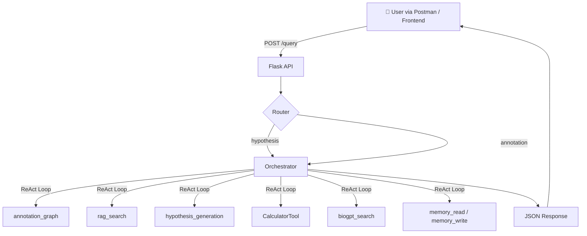

# Rejuve Biotech AI Assistant

Welcome to the **Rejuve Biotech AI Assistant** repository. This comprehensive guide covers the system architecture, in-depth documentation of all agent tools, a testing guide for running the Orchestrator, and future plans for expanding the assistant's capabilities to empower biological research and translation.

---

## 1. Complete System Walkthrough

### The Big Picture

The AI Assistant is a **multi-agent system** where one central brain (the **Orchestrator**) receives the user's question and intelligently decides which specialist tools to call — and in what order — to produce a final answer.



### Step 1: User Sends a Query

The user sends a **POST request** to `/query` using **form-data** (as seen in the Postman screenshot):

| Key | Value |
|---|---|
| `query` | `Generate a hypothesis for rs9939609 in Adipose Subcutaneous.` |
| `user_id` | `test_user_000012` |
| `resource` | `orchestrator` |


### Step 2: Flask API & Router

The Flask app receives the request in `app/__init__.py` → `handler.py`.

- It loads the **user's conversation history** and **memory** from MongoDB.
- It checks the `resource` field:
  - If `resource = "orchestrator"` → route to Orchestrator
  - *(All queries now go to the Orchestrator as the central brain)*

### Step 3: The Orchestrator — The Central Brain

The Orchestrator uses a **ReAct (Reason + Act) loop** powered by LangChain.

#### What is ReAct?

ReAct is a reasoning loop that cycles through three steps repeatedly:

```
Thought → Action → Observation → Thought → Action → ...→ Final Answer
```

| Step | What happens |
|---|---|
| **Thought** | The LLM reads the question + previous results and decides what to do next |
| **Action** | The LLM picks a tool and writes an input for it |
| **Observation** | The tool runs and returns its result back to the LLM |

This loop repeats until the LLM writes **"Final Answer:"** — at which point the loop ends and the response is returned.

#### How the Orchestrator Selects Tools

The LLM is given a **system prompt** that describes all available tools and their purposes. It selects a tool based on keywords in the question:

| Trigger Words | Tool Selected |
|---|---|
| `math`, `sqrt`, `calculate`, `%` | `CalculatorTool` |
| gene name, protein, interaction, transcript | `annotation_graph` |
| `hypothesis`, `rsID`, `variant`, `tissue` | `hypothesis_generation` |
| `whitepaper`, `Rejuve`, `study`, `research` | `rag_search` |
| fallback — none of the above work | `biogpt_search` |
| `remember`, `store`, need memory | `memory_write` / `memory_read` |

### Step 4: Final API Response Assembly

After the ReAct loop ends with **"Final Answer:"**, the Orchestrator's `execute()` method assembles the final JSON response:

```json
{
  "text": "The hypothesis for rs9939609 is: ...",
  "outputs": [{ "stdout": "...", "description": "Orchestration" }],
  "resource": {
    "id": "hyp_59dc4fa7",
    "type": "hypothesis",
    "graph": {
      "nodes": [...],
      "edges": [...]
    }
  },
  "artifacts": [],
  "manifest": { ... }
}
```

| Field | Source |
|---|---|
| `text` | The LLM's Final Answer string |
| `outputs[].stdout` | Same as `text`, formatted for frontend |
| `resource` | Graph JSON saved in `shared_state` by the tool that ran |
| `artifacts` | Files produced (currently empty for most tool runs) |
| `manifest` | Run metadata (LLM used, run_id, inputs, limits) |

### Summary Flow for One Request

```
User → POST /query
    → Flask Router
    → Orchestrator (Groq LLM with ReAct)
        → Thought: "What tool do I need?"
        → Action: annotation_graph("BRCA1")
        → Observation: "Found gene node..."
        → Thought: "Now search RAG for whitepaper..."
        → Action: rag_search("Rejuve aging pathways")
        → Observation: "Found 10 chunks..."
        → Thought: "I have enough to answer."
        → Final Answer: "BRCA1 is related to..."
    → Orchestrator injects graph from shared_state
    → JSON Response returned to User
```

The entire system is designed so that **the LLM is always the decision-maker** — it reads each tool's result and decides the next step, making it genuinely intelligent rather than a hardcoded pipeline.

---

## 2. Agent Tools — In-Depth Documentation

This section covers every tool available to the Orchestrator, explaining how each one works internally, what it connects to, and any alternative modes of operation.

### Tool Registry Overview

| Tool Name | Integrated? | Data Source | Fallback |
|---|---|---|---|
| `CalculatorTool` |  Full | Python REPL + file system | 3-attempt retry |
| `annotation_graph` |  Full | Local Neo4j / External API | Local mode auto-switch |
| `hypothesis_generation` |  Full | Mock / Real Hypothesis Server | Error messages |
| `rag_search` |  Full | Qdrant Vector DB | Returns empty if no hits |
| `biogpt_search` |  Full | ngrok Remote API | Local CPU model |
| `memory_write` |  Full | In-memory session dict | N/A |
| `memory_read` |  Full | In-memory session dict | Returns "No memory found" |
| `galaxy_tools` |  Placeholder | Galaxy Platform | N/A (not implemented) |

### 2.1  CalculatorTool — Far More Than a Calculator

**Source:** `app/calculator/agent.py` + `app/calculator/plotting.py`, `stats.py`, `loaders.py`

The `CalculatorTool` is the most powerful and flexible tool in the system. It is not just a calculator — it is a **full Python code execution environment** that can perform data science, statistical analysis, file parsing, and data visualization.

#### How It Works Internally

When the Orchestrator calls this tool, it spawns a **nested ReAct agent** inside it:

```
Orchestrator
  └─ CalculatorTool._run(instructions)
       └─ CalculatorAgent.run(instructions, context_data)
            └─ Inner ReAct Agent (LangChain)
                 └─ PythonREPLTool.run(python_code)
```

The inner agent:
1. Reads the instructions + any file context in its prompt
2. Writes Python code to accomplish the task
3. Uses `PythonREPLTool` to actually execute the Python code in a live REPL
4. Reads the REPL output as its "Observation"
5. Loops until it has a satisfactory answer

#### What It Can Do

**Math and Computation**
```
"What is the square root of 2048?"
"What is the compound interest on $5000 over 3 years at 4.5%?"
```
Generates and executes Python like:
```python
import math
print(math.sqrt(2048))  # → 45.25
```

**Data Analysis from Uploaded Files**
The Orchestrator can pre-load files (CSV, PDF, HTML, XML, URL) before calling the tool. The agent receives a detailed prompt with file paths, column names, and data shapes:
```
"Analyze this CSV file and show the mean age by group."
```
The inner agent generates:
```python
import pandas as pd
df = pd.read_csv('/path/to/uploaded_file.csv')
print(df.groupby('group')['age'].mean())
```

**Visualization / Plots**
This is where the tool goes far beyond "just calculating." It can generate real plot image files:
```
"Plot a histogram of the BMI column and save it."
"Generate a correlation heatmap for this dataset."
```
The agent generates:
```python
import matplotlib.pyplot as plt
import pandas as pd
df = pd.read_csv('/path/to/data.csv')
plt.figure(figsize=(10, 6))
df['BMI'].hist(bins=30)
plt.savefig('/output/bmi_histogram.png')
```
The saved image is then returned as an **artifact** in the API response under `artifacts[]`.

**File Parsing (Multi-format)**
The agent has access to the `app/calculator/loaders` module:
- `load_csv()` — Pandas DataFrame from CSV
- `load_pdf()` — pdfplumber / camelot for tables in PDFs
- `load_html()` — Parse HTML tables
- `load_xml()` — Parse XML files
- `load_url()` — Fetch and parse a live URL

**Statistical Analysis**
Via `app/calculator/stats.py`:
```python
from app.calculator.stats import correlations
result = correlations(df)
```
And via `app/calculator/plotting.py`:
```python
from app.calculator.plotting import save_correlation_heatmap
save_correlation_heatmap(df, 'output/heatmap.png')
```

#### Execution Limits and Retry Logic
```
Timeout:       120 seconds (configurable via CodeExecOptions)
Memory:        2048 MB limit
Max iterations: 20 (per inner agent loop)
Retry on error: 3 attempts with exponential backoff (2s, 4s, 8s)
```

### 2.2  annotation_graph — Knowledge Graph Lookup

**Source:** `app/agents/annotation/` + `app/tools/agent_tools.py::AnnotationTool`

Queries a **Neo4j property graph** for structured biological data.

#### Two Modes of Operation

| Mode | When Used | Data Source |
|---|---|---|
| **Local Mode** | `ANNOTATION_SERVICE_URL` not set in `.env` | Local Neo4j (populated from `populate_db.cypher`) |
| **External Mode** | `ANNOTATION_SERVICE_URL` is set | Remote Rejuve annotation API |

The mode switch is **automatic** — the agent checks the env var at startup and configures itself accordingly.

#### 5-Step Internal Pipeline

```
Query String
  1. Extract → LLM identifies node types, IDs, and relationships from the query
  2. Convert → Converts to intermediate JSON {"nodes": [...], "predicates": [...]}
  3. Validate → Looks up each entity in Neo4j (fuzzy match, confidence score)
  4. Cypher  → Converts JSON to a Cypher query and runs it against Neo4j
  5. Summarize → LLM reads raw Neo4j result and writes human text
```

#### Graph Data Preservation (Shared State)
When annotation results are found, the raw JSON graph data is saved in the `shared_state` dictionary **before** the text summary is returned to the LLM:
```python
if self.shared_state is not None:
    if "json_format" in result:
        self.shared_state["resource"] = result["json_format"]
```
This bypasses the LLM's text-only limitation and allows the **frontend to receive the real graph JSON** for visualization, even though the LLM only sees a text summary.

### 2.3  hypothesis_generation — 4-Step Enrichment Pipeline

**Source:** `app/hypothesis_generation/hypothesis.py` + `app/tools/agent_tools.py::HypothesisTool`

Orchestrates a multi-step API workflow against the **Hypothesis Microservice** to generate mechanistic biological hypotheses.

#### Pipeline Steps

```
User Query
  ↓
1. NLP Extraction (Regex + LLM fallback)
   → Extracts: variant = "rs9939609", tissue = "Adipose_Subcutaneous"
  ↓
2. Project Validation
   → POST /projects → checks all projects for matching variant + tissue
   → Three outcomes:
       Both found in same project → proceed to enrichment
       Variant not found anywhere → error + lists all available variants
       Variant/tissue in different projects → error + lists compatible tissues
  ↓
3. Enrichment Workflow (4 API calls)
   → POST /enrich                    → Start enrichment, get hypothesis_id
   → GET  /hypothesis?id=...         → Poll status (up to 60 seconds)
   → GET  /enrich?id=...             → Fetch GO terms (causal gene, pathways)
   → POST /hypothesis (final)        → Generate summary + graph JSON
  ↓
4. Graph Preservation
   → result["resource"]["graph"] saved to shared_state
   → Frontend receives full nodes/edges visualization data
```

#### Intelligent Error Handling

| Scenario | Error Type | Response |
|---|---|---|
| `rs9999999` (unknown variant) | `variant_not_found` | Lists all known variants + their projects |
| `rs1421985` in `Pancreas` (mismatch) | `mismatch` | Explains which project has the variant and what tissues it supports |
| `rs7777777` (hallucination test) | `variant_not_found` | Does NOT hallucinate — returns clean "not found" |

### 2.4  rag_search — Vector Semantic Search

**Source:** `app/agents/rag/` + `app/tools/agent_tools.py::RAGTool`

Searches a **Qdrant vector database** using semantic (meaning-based) similarity rather than exact keyword matching.

#### How It Works

```
User Query  →  SentenceTransformer encodes it  →  Dense vector
                                                        ↓
                          Qdrant SITE_INFORMATION collection
                          (10 nearest chunks returned)
                                                        ↓
                   LLM reads the chunks + question → Summarized answer
```

#### Data Source
The `SITE_INFORMATION` Qdrant collection contains chunks from `sample_data.json`:
- Rejuve Biotech whitepaper (AI, BioAtomspace, longevity research)
- Research papers (ReBuilder supplement, Alzheimer's pilot study, Methuselah fly research)
- Company information

### 2.5  biogpt_search — Dual Mode: Remote API → Local Fallback

**Source:** `app/biogpt/agent.py` + `app/tools/agent_tools.py::BioGPTTool`

This is the most interesting tool in terms of its execution strategy: it has **two completely different ways to generate answers**, and it automatically switches between them.

#### Mode 1: Remote API (Primary)

When `BIOGPT_SERVICE_URL` is set in `.env` (currently: `https://jaime-pernicious-jenise.ngrok-free.dev`):

```python
url = f"{self.service_url}/generate"
payload = {"prompt": query, "max_length": max_length}
response = requests.post(url, json=payload, timeout=30)
```

The ngrok URL exposes a remotely-hosted, fine-tuned BioGPT model. The service handles all the heavy model inference on a remote server, returning only the text answer. This is **fast** and requires no local GPU.

#### Mode 2: Local HuggingFace Model (Automatic Fallback)

If the remote API times out, returns an error, or `BIOGPT_SERVICE_URL` is unset, the system **automatically falls back** to running the model locally:

```python
# The model is loaded LAZILY — only when first needed
# Model: kirubel1738/biogpt-bioqa-lora-merged (a LoRA fine-tuned version of BioGPT)
BioGPTAgent._tokenizer = BioGptTokenizer.from_pretrained(model_name)
BioGPTAgent._model = BioGptForCausalLM.from_pretrained(model_name)

# Automatically uses GPU (CUDA) if available, otherwise falls back to CPU
BioGPTAgent._device = "cuda" if torch.cuda.is_available() else "cpu"
BioGPTAgent._model.to(BioGPTAgent._device)
```

#### When It Gets Called
Because it's marked **"LAST RESORT ONLY"** in its description, the LLM only calls it after `annotation_graph` and `rag_search` have both been tried and failed to return a satisfactory answer.

### 2.6  memory_write / memory_read — Session Key-Value Store

**Source:** `app/tools/agent_tools.py::MemoryWriteTool`, `MemoryReadTool`

A simple in-memory key-value store that persists facts **within a single user session**.

#### How Write Works
```
Input format: "key: value"
Example:      "hypothesis_rs9939609: Mocked hypothesis summary..."

→ Splits on the first ":"
→ Stores key → value in the MemoryStore dict
→ Returns: "Stored 'key': 'value'"
```

#### When the Orchestrator Uses Memory
The Orchestrator uses memory **proactively** because its system prompt instructs it to:
1. **First check memory** before calling any expensive tool (avoids redundant API calls)
2. **Write results** after discovering new biological facts (causal genes, hypotheses, chromosomes)
3. **Read memory** in follow-up questions to reuse previously computed results

### 2.7  galaxy_tools — Placeholder (NOT YET INTEGRATED)

**Source:** `app/tools/agent_tools.py::GalaxyTool`

Galaxy is a scientific workflow platform used widely in bioinformatics. The `GalaxyTool` class exists and is **registered with the Orchestrator**, but its `_run()` method is currently a stub.

To fully integrate Galaxy, the `_run()` method would need to:
1. Connect to a Galaxy server instance via the BioBlend Python library
2. Accept a bioinformatics workflow description from the Orchestrator
3. Trigger a Galaxy workflow execution (e.g., RNA-seq alignment, variant calling)
4. Poll for completion
5. Return the workflow results or output file paths

---

## 3. Orchestrator Testing Guide: Docker & Postman

This section provides step-by-step instructions on how to build and run the AI Assistant using Docker, and how to verify that the Orchestrator is correctly routing your queries to the appropriate tools.

### Part 1: Running the AI Assistant

#### 1. Start the Mock Hypothesis Server
Since the Hypothesis Agent relies on a mock backend for local testing, you must start it first in a separate WSL terminal window.

```bash
# Open a new WSL terminal
cd "the_other_multi_agnet_arch/Mock_Hypothesis_services"

# Activate the virtual environment
source venv/bin/activate

# Start the mock server
python mock_hypothesis_server.py
```
*Keep this terminal open and running.*

#### 2. Configure Your Environment
Ensure your `.env` file in the root `AI-Assistant` folder correctly points to the mock server using your Docker gateway IP (usually `172.17.0.1` or similar).

```env
HYPOTHESIS_CHAT_ENDPOINT=http://172.17.0.1:9001/api/mock/hypothesis/chat
HYPOTHESIS_MAIN_ENDPOINT=http://172.17.0.1:9001/api/mock/hypothesis/main
HYPOTHESIS_DATA_API=http://172.17.0.1:9001/api/mock/hypothesis
```

#### 3. Build and Start the Docker Containers
In your primary WSL terminal, navigate to the `AI-Assistant` root directory and start the services.

```bash
# Build and start all services in detached mode
docker compose up --build -d
```

#### 4. Monitor the Logs
To see the Orchestrator making routing decisions in real-time, follow the logs for the primary backend container (`ai-assistant-assistant-1`):

```bash
docker logs -f ai-assistant-assistant-1
```
*Look for `Action: [ToolName]` in these logs as you run your Postman tests!*

### Part 2: Testing with Postman

To verify the Orchestrator is working, we will send POST requests to the `/query` endpoint.

**Endpoint Details:**
- **URL:** `http://localhost:5002/query` (Check your specific mapped port if different)
- **Method:** `POST`
- **Headers:** *No manual headers needed, Postman handles `multipart/form-data` automatically.*
- **Body Setup:** Select the **Body** tab in Postman, choose **form-data**.

By setting the `"resource"` field to `"orchestrator"`, we ensure the central brain handles every query. Below are the form-data fields you can set to trigger each specific agent.

#### Test 1: The `CalculatorTool`
**Body (form-data):**
- **query** (Text): `What is the square root of 2048, and what is 15% of 340?`
- **user_id** (Text): `test_user_000012`
- **resource** (Text): `orchestrator`

* **Expected Log Output:** `Action: CalculatorTool` followed by `Action: Python_REPL`

#### Test 2: The `rag_search` Tool
**Body (form-data):**
- **query** (Text): `What is the Rejuve Biotech whitepaper about and what is the StemCell100 supplement?`
- **user_id** (Text): `test_user_000012`
- **resource** (Text): `orchestrator`

* **Expected Log Output:** `Action: rag_search`

#### Test 3: The `annotation_graph` Tool
**Body (form-data):**
- **query** (Text): `What are the transcripts and proteins associated with the BRCA1 gene?`
- **user_id** (Text): `test_user_000012`
- **resource** (Text): `orchestrator`

* **Expected Log Output:** `Action: annotation_graph`

#### Test 4: The `hypothesis_generation` Tool
**Body (form-data):**
- **query** (Text): `Generate a hypothesis for the genetic variant rs9939609 in Adipose Subcutaneous.`
- **user_id** (Text): `test_user_000012`
- **resource** (Text): `orchestrator`

* **Expected Log Output:** `Action: hypothesis_generation` followed by `Action: memory_write`.

#### Test 5: The `biogpt_search` (Last Resort Fallback)
**Body (form-data):**
- **query** (Text): `What is the current clinical trial status for rapamycin as a longevity intervention in humans?`
- **user_id** (Text): `test_user_000012`
- **resource** (Text): `orchestrator`

* **Expected Log Output:** You should see `Action: annotation_graph` fail, then `Action: rag_search` fail, and finally `Action: biogpt_search`.

#### Test 6: Multi-Agent Context Chaining
**Body (form-data):**
- **query** (Text): `What genes are related to BRCA1, and what does the Rejuve Biotech whitepaper say about the role of genetic pathways in aging?`
- **user_id** (Text): `test_user_000012`
- **resource** (Text): `orchestrator`

* **Expected Log Output Chain:** 
  1. `Action: annotation_graph` 
  2. `Action: rag_search`
  3. `Action: biogpt_search`
  4. `Action: memory_write`

---

## 4. Future Agent Expansion Plan

As the AI Assistant matures, the next phase of development focuses on moving from **data analysis** to **translational impact and proactive discovery**. This section outlines the planned addition of two high-impact agents designed specifically to empower Rejuve Biotech researchers: the **Clinical Trial Matcher Agent** and the **Literature Monitor Agent**.

### 4.1 Clinical Trial Matcher Agent 
> [!NOTE]
> **Status: Implemented.** You can view the code for this agent here: [Clinical Trial Matcher Agent Branch](https://github.com/kirubel-Nigussie/AI-Assistant/tree/Clinical-Trial-Matcher-Agent)

**Type:** Orchestrator-Integrated Tool (Synchronous LLM Agent)

#### What It Does
This agent bridges the gap between basic biological hypothesis generation and active human clinical programs. When a researcher queries a specific disease, genetic variant, or drug target, this agent queries external registries (e.g., ClinicalTrials.gov API, WHO ICTRP) to find active, recruiting, or recently completed clinical trials.

#### Why It's Great for Rejuve Bio
It connects basic research directly to patient care and longevity interventions. If the `hypothesis_generation` agent identifies a strong mechanistic link between a variant (e.g., `rs9939609`) and a target gene (e.g., `FTO`), the Clinical Trial Matcher can immediately answer: 
*"Are there any active longevity or obesity trials currently testing inhibitors for this target?"*

This accelerates the translational pipeline, helping Rejuve researchers identify repurposable drugs or benchmark against competitive trials.

#### System Integration & Conflict Analysis
- **Integration:** Added as a standard `BaseTool` (e.g., `TrialMatcherTool`) within `agent_tools.py`.
- **Orchestrator Role:** The Orchestrator can intelligently chain this. It can run `hypothesis_generation` → store the target gene in `memory_write` → pass the target to the `Clinical Trial Matcher`.
- **Conflict Analysis:** **None.** It perfectly complements existing tools without overlapping. While BioGPT provides general trial history from its training data, this agent provides real-time, structured, up-to-date trial statuses.

### 4.2 Literature Monitor Agent
**Type:** External Background Service (Asynchronous Data Producer)

#### What It Does
Unlike existing agents that wait for a user prompt, the Literature Monitor runs autonomously in the background. It proactively monitors biomedical preprint servers and journals (PubMed, bioRxiv, MedRxiv, Google Scholar limits permitting) for new publications matching Rejuve's core interests (specific longevity genes, age-related diseases, novel biomarkers). It ingests, chunks, embeds, and feeds these fresh papers directly into the Qdrant Vector Database.

#### Why It's Great for Rejuve Bio
It shifts the paradigm of the AI Assistant from **"User-Initiated Search"** to **"System-Initiated Awareness."** 
Aging research is moving incredibly fast. Researchers often miss breakthrough papers because they don't have time to run daily PubMed searches. This agent ensures that the `rag_search` database is always at the cutting edge. When a researcher asks the AI Assistant about a pathway, they aren't just getting data from yesterday—they are getting data published *this morning*.

#### System Integration & Conflict Analysis
- **Integration:** Built entirely *outside* the Orchestrator loop. It will likely run as a standalone Python worker/cron job (`celery` or simple scheduler) that speaks directly to the Qdrant DB.
- **Conflict Analysis:** **No Conflict. Perfect Synergy.** This agent acts as a **content producer**, while the existing `rag_search` agent acts as the **content consumer**. By keeping this logic out of the Orchestrator, we prevent the user-facing chat from being bogged down by slow web scraping tasks.

### Value Proposition: The "Complete" Translational Loop

By adding these two agents, the Rejuve AI Assistant achieves a complete, closed-loop translational research workflow:

1. **Awareness (Literature Monitor):** Ingests a brand new paper on a novel aging marker while the researcher sleeps.
2. **Retrieval (RAG):** The researcher asks about the marker, and the Orchestrator pulls the fresh paper.
3. **Structure (Annotation Graph):** The Orchestrator maps the marker to known Ne04j gene pathways.
4. **Mechanism (Hypothesis):** The Orchestrator generates a specific mechanistic hypothesis for how that marker affects a specific tissue.
5. **Translation (Trial Matcher):** The Orchestrator checks if anyone is already running clinical trials against it.

This future architecture transforms the Assistant from a powerful querying tool into a proactive research partner capable of driving real-world therapeutic discoveries.
